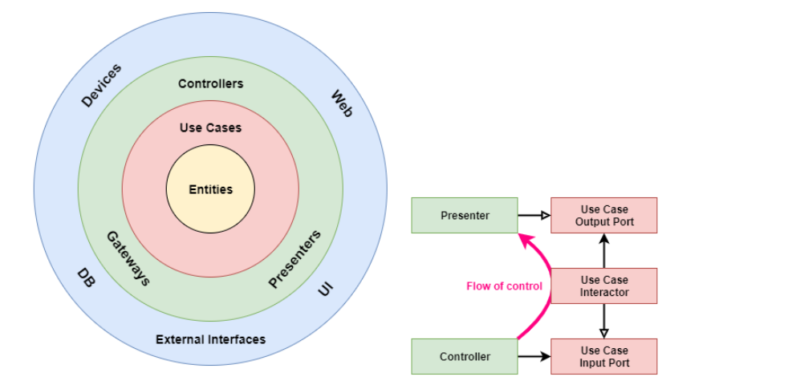
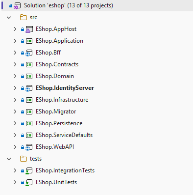
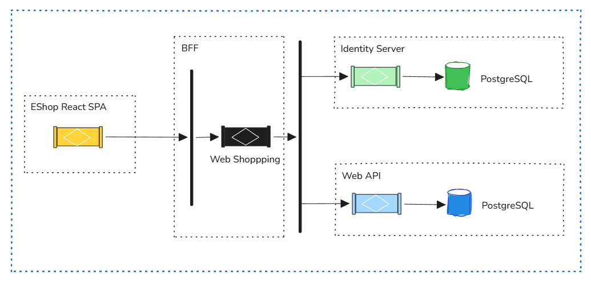
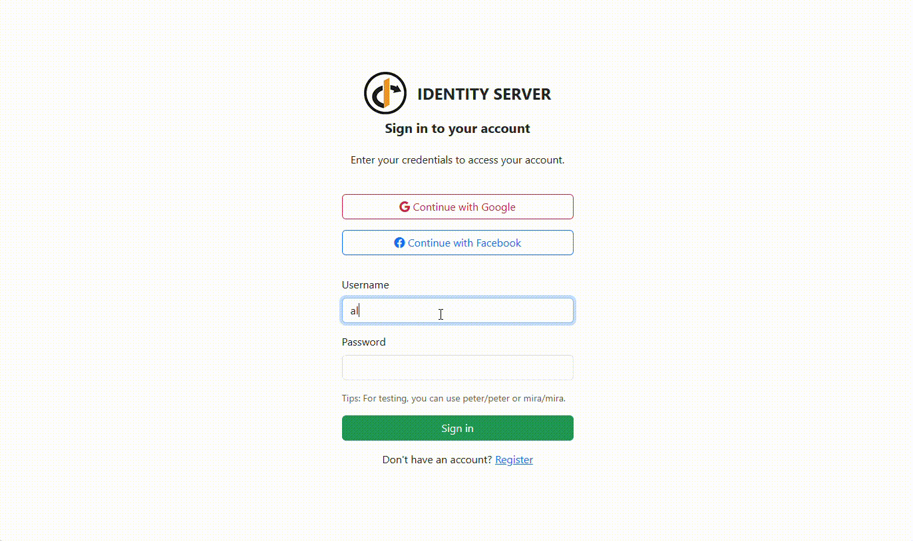
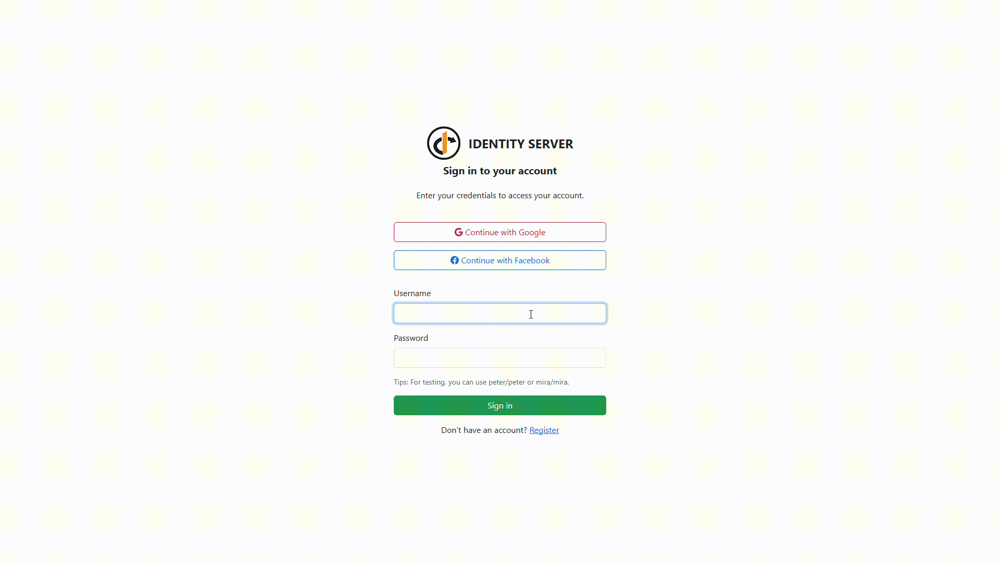

# Eshop

> 🛍️ A practical e-commerce application built with .NET for the backend and React (Vite) for the frontend, demonstrating clean architecture and the latest technologies.

## Purpose

Provide a sample production-ready foundation for an online store with clean architecture and domain-driven design.

## Key Features

- HTTP APIs for Basket, Catalog, Customer, Identity, Order, and Payment.
- Aspire used to local orchestration.
- Domain‑driven design: entities, value objects, and domain events.
- Seperate commands, queries in per feature.
- JWT authentication and Cookie authentication
- Unit and integration test projects.

## Goals of This Project

- ❇️ Using `Clean Architecture` for architecture level.
- ❇️ Using `CQRS` implementation with `MediatR` library.
- ❇️ Using `Fluent Validation` and a `Validation Pipeline Behaviour` on top of `MediatR`.
- ❇️ Using `Unit Testing` for testing small units and mocking
- ❇️ Using `Docker` for containerization
- ❇️ Using `Nginx` for reserve proxy
- ❇️ Using `Aspire` for local development, fast test
- ❇️ Integration payment gateway with a `Stripe`
- ❇️ Identity and authentication via `Duende IdentityServer`.
- ❇️ Using storage: local filesystem and `Azure Blob` provider.
- ❇️ Observability via `OpenTelemetry` (instrumentation + exporters).
- ❇️ Email notifications via SMTP and background host services.
- ❇️ In-memory caching

## Technologies - Libraries

- ✔️ `.NET 9` – runtime and SDK used across services.
- ✔️ `Entity Framework Core` – persistence, migrations, etc
- ✔️ `MediatR` – CQRS and in-process messaging (handlers + pipeline behaviors).
- ✔️ `FluentValidation` – command validators and validation pipeline integration.
- ✔️ `Duende.IdentityServer` – Identity and authentication.
- ✔️ `OpenTelemetry` – tracing and metrics instrumentation.
- ✔️ `Stripe` – payment provider implementation and factory-based payment gateway.
- ✔️ `Azure Blob Storage` and local file storage managers.
- ✔️ `Swashbuckle / OpenAPI` (Swagger) – API documentation and UI.
- ✔️ `React` + `Vite` – storefront frontend.
- ✔️ `xUnit.net` – unit and integration testing projects.
- ✔️ `Docker`, `Nginx` – containerized dev/production setups and reverse proxy.
- ✔️ `Aspire` – local orchestration for multi-service development.
- ✔️ `Microsoft.Extensions.Caching.Memory` – in-memory caching support.

## The Clean Architecture

## Solution Structure

## Workflow

## Demo

#### Identity Server

#### StoreFront

